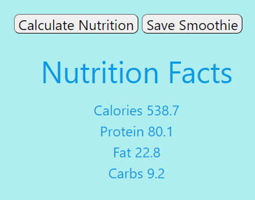
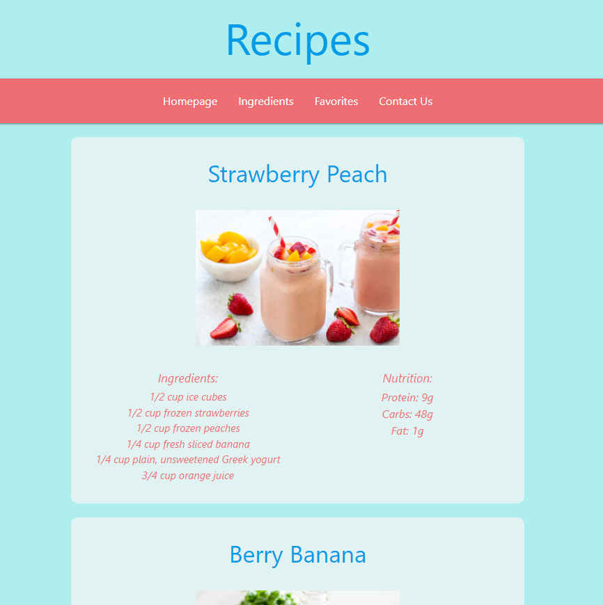

# camp-smoothie

# Purpose
This group project focused on creating and executing a web application with team members to solve a real-world problem. Our application allows users to create a smoothie based on a set list of ingredients and see the nutritional output based on all of the ingredients they have chosen. We have used server-side APIs to retireve the nutritional information. Users can also save their favorite smoothie from our set list of smoothies on our "favorites page".

# Built With
• HTML
• CSS
• JavaScript
• JQuery
• Materialize

# Website
[Camp-Smoothie](https://bethanyjean.github.io/camp-smoothie/)

# Contributors
John Hamborsky  
Marina Kaeufer  
Bethany Griffin  
